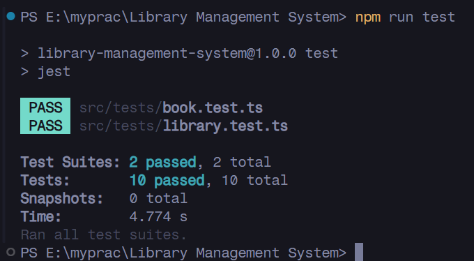

# Kata: Library Management System

## Table of Contents

- [Objective](#objective)
- [Requirements](#requirements)
- [Instructions](#instructions)
  - [Code Only](#code-only)
  - [Test-Driven Development (TDD)](#test-driven-development-tdd)
  - [Clean Coding Practices](#clean-coding-practices)
  - [Git Usage](#git-usage)

## Objective

Create a simple library management system that allows users to perform basic operations such as adding books, borrowing books, returning books, and viewing available books.

## Requirements

- **Add Books:**

  - Users should be able to add new books to the library.
  - Each book should have a unique identifier (e.g., ISBN), title, author, and publication year.

- **Borrow Books:**

  - Users should be able to borrow a book from the library.
  - The system should ensure that the book is available before allowing it to be borrowed.
  - If the book is not available, the system should raise an appropriate error.

- **Return Books:**

  - Users should be able to return a borrowed book.
  - The system should update the availability of the book accordingly.

- **View Available Books:**
  - Users should be able to view a list of all available books in the library.

## Instructions

- **Code Only:**

  - This is a code-only kata. Focus on writing clean, maintainable code and implementing the required features. Do not spend time creating any user interface.

- **Test-Driven Development (TDD):**

  - Write tests before implementing the functionality. Follow the three laws of TDD:
  - Ensure that all tests pass before considering the implementation complete.
  - Aim for high test coverage and meaningful test cases.

- **Clean Coding Practices:**

  - Write clean, readable, and maintainable code.
  - Follow SOLID principles and other best practices in software design.
  - Ensure the code is well-documented with meaningful comments and clear variable/method names.

- **Git Usage:**
  - Use Git for version control.
  - Create a Git repository for your project.
  - Commit your changes frequently with meaningful commit messages to show your TDD journey.
  - Push your code to a remote repository (e.g., GitHub, GitLab, Bitbucket) and share the repository link.

## Install Locally

Clone the project

```bash
  git clone https://github.com/rishikesh-revandikar/Library-Management-System.git
```

Go to the project directory

```bash
  cd Library-Management-System
```

Install dependencies

```bash
  npm install
```

## Running Tests

To run tests, run the following command

```bash
  npm run test
```

## Test Report


